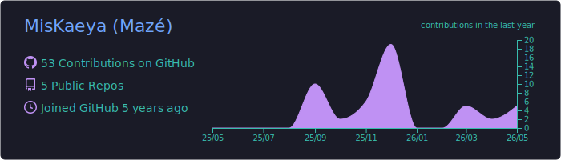
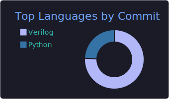
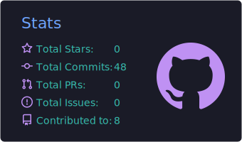
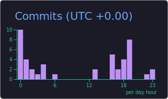

<div align="center">



</div>

---

## 🧬 Stack atual

<div align="center">

[](https://github.com/MisKaeya)
[](https://github.com/MisKaeya)
[](https://github.com/MisKaeya)
[](https://github.com/MisKaeya)

</div>

---

## 🔥 Sequência de contribuições

<div align="center">

[](https://github.com/MisKaeya)

</div>

---

## 🛠️ Tecnologias que já me fizeram questionar minhas escolhas de vida

<div align="center">

[](https://skillicons.dev)

<!-- Verilog e FPGA não têm ícone no skillicons — badges manuais abaixo -->


</div>

---

## 📌 Projetos em destaque

| Projeto | Descrição | Stack |
|--------|-----------|-------|
| [🐍 ComparadorDeCombustivel](https://github.com/MisKaeya/ComparadorDeCombustivel) | Meu primeiro código — onde tudo começou | `Python` |
| [🧙 TheLordOfHidenSeek](https://github.com/MisKaeya/TheLordOfHidenSeek) | Jogo de esconde-esconde inspirado em Tolkien | `Python` |
| [🔬 ProjetoZoomDigital](https://github.com/MisKaeya/ProjetoZoomDigital) | Redimensionamento de imagens em FPGA | `Verilog` |
| [🐱 KittyMonitorator](https://github.com/MisKaeya/KittyMonitorator) | Porque todo bom projeto precisa de um gato no nome | `Python` |

---

## 🎯 Atualmente

```python
mazé = {
    "foco":       "Engenharia de Computação",
    "aprendendo": ["DSP", "Sistemas Embarcados", "Arquitetura de Computadores"],
    "feito de":   "café + curtos-circuitos + bugs inexplicáveis às 2h da manhã",
    "meta":       "um projeto que funcione na primeira compilação",  # sonhar é de graça
}
```

---

<div align="center">

<sub><i>"Qualquer tecnologia suficientemente avançada é indistinguível de um bug que funciona."<br>— Arthur C. Clarke, provavelmente.</i></sub>

<br><br>


</div>